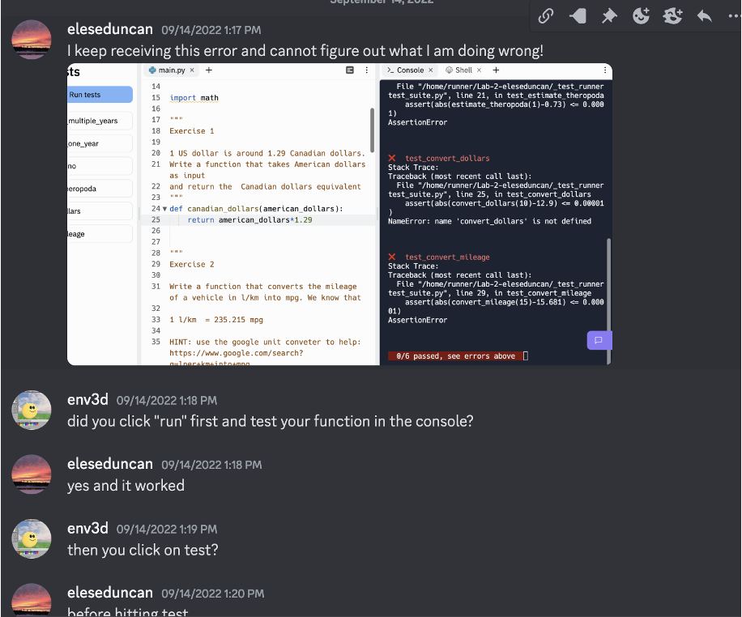
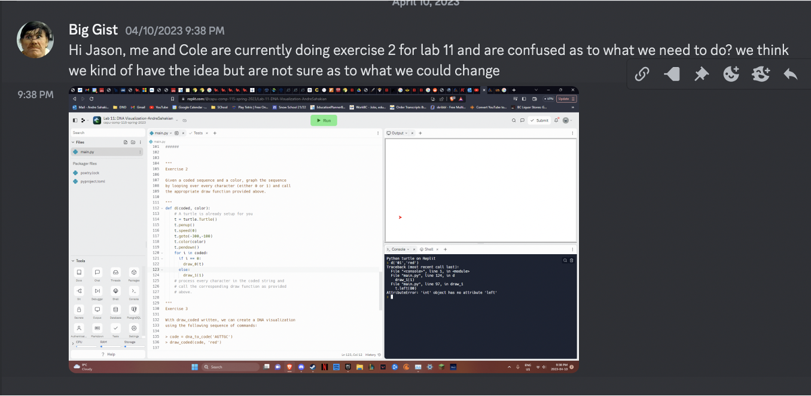
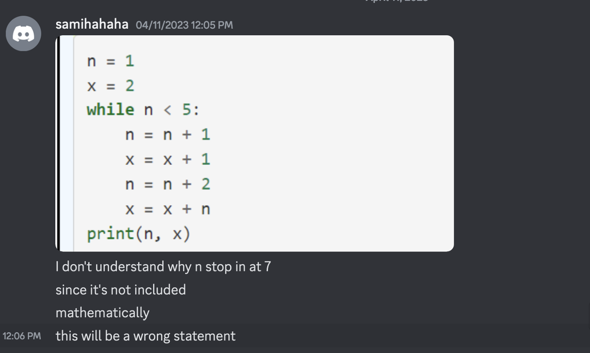

## COMP 115 Learn To Code

 - Instructor: Jason Madar [https://ca.linkedin.com/in/jasonmadar](https://ca.linkedin.com/in/jasonmadar)
 - Email: jmadar@capilanou.ca
 - Class Discord: [https://discord.gg/cMkkGeR62G](https://discord.gg/cMkkGeR62G)
 - Office Hours: After class Wednesday and Friday

---

In the age of AI

Do we still need to learn how to code?
<!-- .element: class="fragment" -->

---

## Vibe Coding

 - There are many "Vibe Coding" platforms that promised to let non-coders create software.

 - Here's one: <a href="https://lovable.dev/" target="_blank">https://lovable.dev/</a>

---

## Exercise

  - Create a free account
  - Come up with an idea for an "app"
  - Create the app by typing your idea as a "prompt"
  - Test out the "app", do not continue to improve the app
  - Also click on the "Code" button to inspect the code
  - Prepare to share with class answers to the following questions

---

## Share

  - Your prompt
  - How long does it take for the "app" to generate?
  - Does it work?
  - Does it cover all the features you want?
  - Where does the "app" run?
  - Can you make other people run your "app"?
  - What programming language is the app written in?
  - If you had to change just one specific button color or move a menu, could you find the exact line of code to do it without asking the AI again?
  - Ask lovable to rewrite the app in python, what is its answer?

---

## Learning

  - The world is run by software
  - *Vibe Coding* tools allow non-technical people to get started in coding
  - Creating an app, or simple automating certain parts of your work, requires actual expertise in logical thinking and coding
  - This class is not going to turn everyone into professional programmers

---

## Learning

  - You will learn coding concepts
  - More importantly, you will learn concepts in logical thinking and problem solving
  - These concepts will equip you with better way to instruct AI
  - But for those who are interested in moving into computer science, you will also 
  gain actual coding skills

---

## Grading

Your grade is determined by your level of independence from the "Machine"
 

---

### **C Level**
* **Definition:** You can recognize core concepts, interpret short code segments, and make small edits to existing examples.
* **The Skill:** Recognition. You can look at a `loop` and identify what it is doing.

---

### **B Level**
* **Definition:** You can precisely specify a solution strategy, using correct technical concepts and decomposition, so that an AI can generate a working Python program for a novel but bounded task.
* **The Skill:** Decomposition. You can break a complex idea into small, logical steps that an AI can understand to produce python code.

---

### **A Level**

* **Definition:** You can independently design, write, debug, and revise Python code by hand for new small problems, because you understand both the problem-solving strategy and the underlying programming mechanism.
* **The Skill:** You can write the python syntax perfectly because you understand the underlying mechanism.  You can also identify errors in code and fix them.

---

## Additional Notes

While this class is not about learning how to use AI, you will find that many of the AI prompting principles actually came from computer science.

Here's a nice AI prompting guide <a href='https://www.codecademy.com/article/how-to-create-effective-ai-prompts' target='_blank'>https://www.codecademy.com/article/how-to-create-effective-ai-prompts</a>.

Over this course, you will hopefully see many idea of what we are learning in class reflected in this guide.

---

## Class Workflow

**Lecture (Wednesday and Friday)**

  - Review of previous exercises
  - Chapter quiz (30 - 45 minutes)
  - Review quiz answers / short lecture (30 - 45 minutes)
  - Activities and/or exercises

**Labs (Tuesday)**

  - Independent work
  - Real-time support available via discord
  - Lab room available for you to work
  - Optionally work on “Challenge” exercises

---

## How to ask for help

All exercises have immediate feedback via automated tests
If you have a question:
  - No need to start the message with “Hi” or “How are you”, ask the question right away.
  - Take a screenshot of your code and test output
  - Formulate a specific question
  - If you believe the question is of a general nature (such as something I didn’t cover sufficiently in class), post to general channel, otherwise, 

---

---

---

---

# Assessment Breakdown

<table style='font-size: 1em;'>
  <thead>
    <tr>
      <th>Assessment Category</th>
      <th>Weight</th>
    </tr>
  </thead>
  <tbody>
    <tr>
      <td>Readings and Exercises</td>
      <td>30%</td>
    </tr>
    <tr>
      <td>Quizzes and Term Tests</td>
      <td>30%</td>
    </tr>
    <tr>
      <td>Final Examination</td>
      <td>35%</td>
    </tr>
    <tr>
      <td>Performance Evaluation</td>
      <td>5%</td>
    </tr>
    <tr>
      <td><strong>Total</strong></td>
      <td><strong>100%</strong></td>
    </tr>
  </tbody>
</table>

---

## Textbook Assignment

Before the end of class:

- **Read**: Chapters 1
- **Complete**: Chapter 1 Lab

Before next class:

- **Read**: Chapters 2 & 3

=====/

