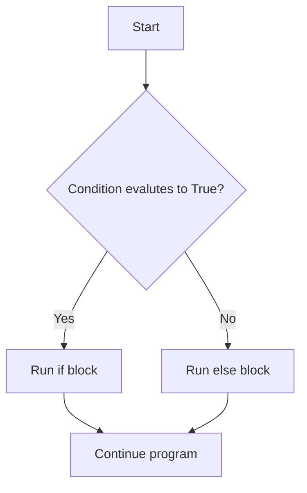

# Decision Making with Booleans (Chapter 7)

This chapter introduces three big ideas:

1. Booleans are a data type.
2. if / else lets us choose what code runs.
3. Boolean functions return True or False.

---

## 1) Boolean is a Data Type

Python has a special data type named bool.

There are only two Boolean values:
- True
- False

```python
print(type(True))
print(type(False))
print(1 != 2)
print(3 == 5)
```

Expected output:
```text
<class 'bool'>
<class 'bool'>
True
False
```

A Boolean expression is any expression that evaluates to True or False.

Below expressions use comparison operators:

- 
```python
1 <= 2
```
- 
```python
5 == 5
```
- 
```python
9 != 3
```
- 
```python
a = 5
b = 6
a == b
```

Not a Boolean expression:
- 1 + 2   (this evaluates to 3, an integer)


<quiz>
What is printed?
```python
print(type(True))
```
- [ ] True
- [x] &lt;class 'bool'&gt;
- [ ] &lt;class 'int'&gt;
- [ ] &lt;class 'str'&gt;
</quiz>

---

## 2) Combining Boolean Expressions

We combine Boolean expressions with:
- and
- or
- not

```python
x = 4
y = 9

print(x >= 1 and x <= 6)      # Is x between 1 and 6?
print(x < 1 or x > 6)         # Is x outside 1..6?
print(not (x % 2 == 0 and y % 2 == 0))  # Not both even
```

Quick reminder:
- and needs both sides True
- or needs at least one side True
- not flips True/False


<quiz>
Which expression checks x is between 1 and 6 inclusive?
- [ ] 1 < x < 6
- [ ] x > 1 or x < 6
- [x] x >= 1 and x <= 6
- [ ] x => 1 and x =< 6
</quiz>

---

## 3) if / else Structure

if / else lets your program make decisions.

General pattern:

```python
# condition is a python expression that evaluates to True/False
if condition:
    # runs when condition is True
else:
    # runs when condition is False
```

Example:

```python
a = 5

if a == 5:
    print("A is five")
else:
    print("A is not five")

print("Done")
```

### Classic Decision Flowchart



---

## 4) if / elif / else (Multiple Branches)

Use elif when there are more than two choices.

```python
score = 82

if score >= 90:
    print("A")
elif score >= 80:
    print("B")
else:
    print("Keep practicing")
```

Python checks top to bottom and runs the first matching branch.

---

## 5) Boolean Functions

A Boolean function returns True or False.

```python
def is_between_1_and_6(x):
    return x >= 1 and x <= 6

def is_increasing_middle(x, y, z):
    return x < y and y < z

print(is_between_1_and_6(4))      # True
print(is_between_1_and_6(10))     # False
print(is_increasing_middle(2, 5, 9))   # True
print(is_increasing_middle(7, 5, 9))   # False
```

Why this is useful:
- makes conditions reusable
- makes code easier to read
- easier to test
- can use it inside if statements

<quiz>
What is a Boolean function?
- [x] A function that returns True or False
- [ ] A function that only accepts True as input
- [ ] A function with if/else inside it
- [ ] A variable of type bool
</quiz>

---


---

## Final Summary

- bool is a real Python data type.
- Conditions are built from Boolean expressions.
- if / else controls program flow.
- Boolean functions let us package logic into clear, reusable checks.
